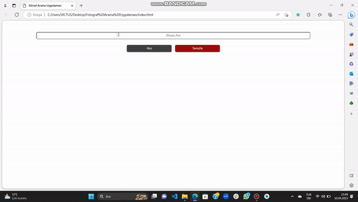

# Javascript Görsel Arama Projesi

[Uygulamayı incelemek için buraya tıklayın](https://kemalbabaoglu.github.io/Gorsel-Arama-Uygulamasi/):point_left:

## Proje Hakkında
Projemiz, unsplash.com isimli sitenin servislerinde yer alan görseller kullanılarak ve aynı zamanda responsive olacak şekilde hazırlanmıştır. 

## Kullanılan Teknolojiler
 - [HTML](https://www.w3schools.com/html/)
 - [CSS](https://www.w3schools.com/css/)
 - [jS](https://www.w3schools.com/css/)

## Önizleme

